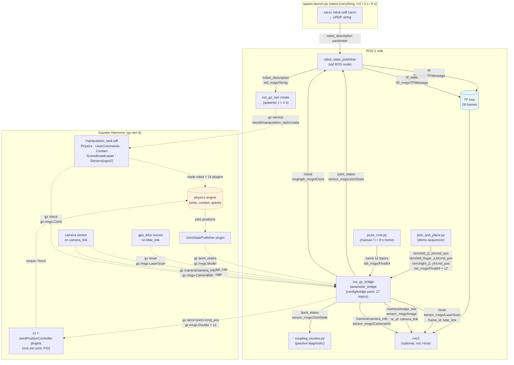

# dual_arm_ws — a ground-up guide to this ROS 2 + Gazebo pick-and-place simulation

This README explains the entire project from scratch, for someone who has never
used ROS before. Every term is defined the first time it appears. Every file name,
topic name, and message type below was read from the actual source in this
repository — not from a template of what a "typical" ROS project looks like. Where
this project deviates from the standard textbook setup (and it does, in several
important ways), the deviation is documented as built.

**Stack:** ROS 2 Jazzy + Gazebo Harmonic (gz-sim 8), connected by the `ros_gz`
bridge. One package: `src/dual_arm_kobuki`.

**If you only read one section**, read [§4 — The full communication workflow](#4-the-full-communication-workflow).
It walks every message from launch to a completed pick-and-place.

---

## Contents

1. [Project overview](#1-project-overview)
2. [The cast of characters (glossary)](#2-the-cast-of-characters)
3. [File-by-file breakdown](#3-file-by-file-breakdown)
4. [The full communication workflow](#4-the-full-communication-workflow)
5. [Workflow diagram](#5-workflow-diagram)
6. [Common gotchas](#6-common-gotchas)
7. [Quick reference: every topic in the system](#7-quick-reference-every-topic-in-the-system)

---

## 1. Project overview

### What the robot is

A simulated mobile manipulator. Picture a robot-vacuum-sized cylindrical base
(modelled on the Kobuki, 35.5 cm across, 2.5 kg) with a flat deck on top. Standing
on the deck, side by side like shoulders, are **two identical 4-joint arms**, each
ending in a **two-finger gripper** that opens to 7 cm. Behind the arms, a two-post
mast carries an **RGB camera** (46 cm above the ground, tilted 23° down) and a
**2D laser rangefinder** (32 cm up, level).

It exists only as a description file and a physics simulation. Nothing here has
been built physically. The base has no wheels — it sits where it's placed and
doesn't drive.

### What "pick and place" means here

The simulated world contains two small tables and three objects. The demo does
exactly this, with the **left arm only**:

1. Reach over to a 5 cm cylinder (80 g) sitting on the "starting" table.
2. Close the gripper on it.
3. Lift it, swing left about 60°, and set it down on the "destination" table.
4. Open the gripper, retreat, and return to a parked "home" pose.

That takes about 14.5 seconds of motion, moving through nine pre-computed
waypoints. The right arm is parked and never moves.

**Three things that are true of this project and often aren't true of tutorial
projects — hold onto these, they explain most of what follows:**

- **The task is scripted, not perceived.** The object's position is a
  hard-coded constant in a Python file. The camera and laser are running and
  publishing data, but *nothing reads that data*. There is no perception.
- **There is no motion-planning library.** No MoveIt, no collision checking. The
  arm's joint angles are computed by ~150 lines of hand-written trigonometry.
- **There is no `ros2_control`.** Each of the 12 moving joints is driven by its
  own tiny controller plugin inside Gazebo, listening on its own topic. Sending
  a number to that topic moves that one joint. That's the entire control layer.

Everything else — the other two objects in the world, the bimanual analysis code,
the coupling monitor — is groundwork for a future two-arm task that doesn't run yet.

---

## 2. The cast of characters

Read these in order; later entries build on earlier ones.

### The robot description

**URDF** (Unified Robot Description Format). An XML file that describes a robot's
physical structure: what rigid pieces it has, how they connect, how big and heavy
each is. It's a *skeleton*, not a program — it says what the robot *is*, never what
it *does*. Every tool in the ecosystem (visualizer, physics engine, kinematics
code) reads the same URDF rather than each re-implementing the robot.

**Xacro** ("XML macros"). URDF has no variables, no arithmetic, and no way to
reuse a block twice. Xacro adds all three as a preprocessor: you write
`.xacro` files with `${variables}`, `${math}`, and reusable macros, run them
through `xacro`, and plain URDF comes out. In this project the arm is one macro
called twice (left, then right, mirrored). All five `.xacro` files together
produce one URDF.

**Link.** A rigid piece of the robot — a rod, a plate, a housing. It has a shape,
a mass, and a colour. It doesn't bend.

**Joint.** The connection between two links, which says how they may move
relative to each other. Every joint has exactly one *parent* link and one
*child* link. Four joint types appear in this robot:

| Type | Motion | Where it's used here |
|---|---|---|
| `revolute` | rotates about an axis, within limits | all 8 arm joints |
| `prismatic` | slides along an axis, within limits | all 4 gripper fingers |
| `fixed` | none — rigidly bolted | sensors, the deck, mounting pads, and the "grasp frame" |
| *(continuous)* | rotates without limits | *not used* — no wheels |

A `fixed` joint sounds pointless but is essential bookkeeping: it's how you say
"the camera is bolted *exactly here* on the mast."

**Coordinate frame** (or just "frame"). An origin plus x/y/z axes attached to a
link. A position like `(0.31, 0.09, 0.225)` is meaningless until you say *relative
to which frame*. Every link in the URDF gets its own frame.

**TF / the TF tree.** "TF" is ROS's system for keeping track of every frame's
position relative to every other frame, continuously, as the robot moves. The
"TF tree" is the whole family tree of frames, each hanging off its parent. Ask TF
"where is the left gripper relative to the base right now?" and it walks the tree
and multiplies out the answer. This robot's tree has **28 frames** rooted at a
frame on the floor called `base_footprint`.

### ROS 2 communication

**Node.** One running program that does one job. ROS software is many nodes
running at once — one publishing sensor data, one computing motion, one
translating between systems — rather than one monolithic program. Each node has
a name (e.g. `robot_state_publisher`, `pick_and_place`).

**Topic.** A named channel that carries a stream of data. Topics have names like
`/scan` or `/arm/left_j1/cmd_pos`, and every topic carries exactly one type of
message.

**Message.** A typed data structure sent on a topic — a struct with named fields.
Types are named `package/msg/Type`. Ones you'll meet here:

| Message type | What's in it |
|---|---|
| `std_msgs/msg/Float64` | one number (`data`) |
| `std_msgs/msg/String` | one string |
| `sensor_msgs/msg/JointState` | arrays of joint names, positions, velocities, efforts |
| `sensor_msgs/msg/LaserScan` | one sweep of a 2D laser: ranges at each angle |
| `sensor_msgs/msg/Image` | one camera frame |
| `sensor_msgs/msg/CameraInfo` | the camera's resolution and lens parameters |
| `rosgraph_msgs/msg/Clock` | the current simulated time |
| `tf2_msgs/msg/TFMessage` | a batch of frame-to-frame transforms |

**Publisher / subscriber.** A node that writes to a topic is a *publisher*; one
that reads from it is a *subscriber*. They never know about each other directly —
a publisher just sends, and any number of subscribers (zero, one, or many)
receive. This anonymity is the point: you can add a logger or a visualizer to any
topic without touching the code that produces it.

**Service.** A request/response call: one node asks, another answers, once. Used
for things that should happen on demand rather than stream continuously. *This
project defines no custom services.* The only service call in the pipeline is the
one that spawns the robot into Gazebo, and that's a Gazebo service, not a ROS one.

**Action.** A long-running request with progress feedback and the ability to
cancel — the standard ROS pattern for "execute this whole trajectory and tell me
how it's going." *This project uses no actions at all.* Motion is streamed as raw
position setpoints on plain topics. This is a real deviation from the textbook
stack and is explained in §4.

**Parameter.** A named configuration value attached to a node, set at launch.
The most important one here is `robot_description` — the entire URDF, as one
string, handed to `robot_state_publisher` as a parameter.

**Launch file.** A Python script that starts many nodes at once with the right
parameters, in the right order, with timing. `launch/spawn.launch.py` is the
single entry point that brings the whole simulation up.

### The two nodes everyone confuses

**`robot_state_publisher`.** A standard ROS node (not written in this project).
It reads the URDF and the current joint angles, runs forward kinematics (the
math that turns "joint angles" into "where is every link"), and publishes the
result as the TF tree. *Why it needs joint angles at all:* the URDF alone only
knows the robot's skeleton — link lengths and which joint connects to which. It
has no idea whether the elbow is currently bent 30° or 90°. The joint angles are
the missing information that turns a static skeleton into a posed robot.

**`joint_state_publisher`.** In the textbook setup, this is a separate ROS node
that *invents* joint angles (from a GUI slider or a default) so that
`robot_state_publisher` has something to work with when there's no real robot.
**This project does not run that node.** The joint angles come from Gazebo's
physics engine, via a Gazebo plugin, and are bridged into ROS. See §4 for the
exact path. (`joint_state_publisher_gui` is listed as a dependency in
`package.xml`, but nothing in the launch file uses it — see gotcha #5.)

### Gazebo-side vocabulary

**Gazebo (gz-sim).** The physics simulator. It owns the world, integrates
gravity and contact, renders the camera and laser, and actually moves the joints.
It is a separate program with its **own** messaging system, distinct from ROS.

**SDF** (Simulation Description Format). Gazebo's native file format. In this
project it describes the *world* — ground, lighting, tables, objects, physics
settings — while the *robot* is described in URDF/Xacro. Gazebo accepts both.

**Plugin / system.** A component loaded into Gazebo to add a behaviour. This
project uses eight kinds. The ones that matter most: `JointPositionController`
(drives one joint toward a target), `JointStatePublisher` (reports joint angles),
`Sensors` (renders camera and laser), and `UserCommands` (provides the spawn
service).

**`ros_gz_bridge`.** A translator node. Because Gazebo and ROS 2 use different
messaging systems, nothing crosses between them unless this bridge is told to
carry it. Every topic in this project that goes ROS↔Gazebo is listed explicitly in
`config/bridge.yaml`. If a topic isn't in that file, it doesn't cross — silently.

**`ros_gz_sim create`.** The node that spawns a robot into a running Gazebo world.
It reads the URDF from a ROS topic and calls Gazebo's spawn service.

---

## 3. File-by-file breakdown

Every file in `src/dual_arm_kobuki/`, grouped by role.

### 3.1 Package manifests

#### `package.xml`

The ROS package's identity card: name (`dual_arm_kobuki`), version, license, and
its **dependencies** — other packages that must be installed for this one to run.
Everything here is an `exec_depend` (needed at run time, not build time), because
this package contains no compiled code: `xacro`, `rclpy` (the Python ROS client
library), `std_msgs`, `robot_state_publisher`, `ros_gz_sim`, `ros_gz_bridge`,
`rviz2`, `launch`, `launch_ros`, and `joint_state_publisher_gui`.

Note the description text says "Milestone 1 = spawn only (no motion
controllers)". That's stale — the package now has 12 position controllers and a
working pick-and-place demo. See gotcha #5.

#### `CMakeLists.txt`

The build recipe, and it's nearly empty because there's nothing to compile. It
does two things: copies the `urdf/`, `worlds/`, `launch/`, and `config/`
directories into the install space so other tools can find them (`share/`), and
marks the four Python files in `nodes/` as executables (`lib/`) so
`ros2 run dual_arm_kobuki <name>.py` works. That second install step is also why
`pick_and_place.py` can do `import arm_kinematics` — the two files land in the
same directory.

### 3.2 Robot description — `urdf/`

Five Xacro files. `robot.urdf.xacro` is the top; it includes the other four.
Running `xacro robot.urdf.xacro` expands the whole tree into one URDF string.

#### `urdf/common.xacro`

**The single source of truth for every dimension in the robot.** No shapes, no
joints — just named numbers: base radius (0.1775 m), deck height (0.14 m), arm
link lengths (0.04 / 0.16 / 0.16 m), gripper stroke (0.035 m per finger), joint
limits, masses, the HOME pose, sensor heights, and the seven named colours. Also
defines two small macros (`cylinder_inertial`, `box_inertial`) that compute a
link's rotational inertia from its mass and shape, so no inertia is ever typed by
hand.

Every value is tagged `[POSTER]` (a locked design-sheet spec) or `[PLACEHOLDER]`
(a plausible guess nobody has decided). Change a number here and every other file
picks it up on the next launch — with one important exception, gotcha #1.

#### `urdf/base.xacro`

The body. Four links: `base_footprint` (a massless frame on the floor, the root of
the whole TF tree), `base_link` (the 2.5 kg cylinder), `top_deck` (the plate the
arms stand on), and `front_marker` (a small red tab so you can tell which way is
forward in the viewer). All joined by `fixed` joints. The base is a plain cylinder
rather than a Kobuki mesh, deliberately — nothing in the arm kinematics depends on
the silhouette.

#### `urdf/arm.xacro`

**One arm, as a macro.** Called twice from `robot.urdf.xacro` with
`prefix="left" reflect="1"` and `prefix="right" reflect="-1"`; the `reflect` flag
only flips the sideways mounting offset. Each call produces 9 links and 9 joints:

```
top_deck ─fixed─► {side}_mount ─[J1 revolute, Z]─► {side}_riser
  ─[J2 revolute, Y]─► {side}_upper_arm ─[J3 revolute, Y]─► {side}_forearm
  ─[J4 revolute, Y]─► {side}_wrist ─fixed─► {side}_palm
      ├─[finger_a prismatic, +Y]─► {side}_finger_a_link
      ├─[finger_b prismatic, −Y]─► {side}_finger_b_link
      └─fixed─► {side}_grasp_frame     (massless — the point IK aims at)
```

Two details that shape everything else: J2, J3 and J4 all rotate about the same
axis direction, so once J1 has chosen a heading the arm is a flat 3-joint
mechanism (this is why the kinematics can be solved by hand). And each finger's
collision surface carries Gazebo friction/contact properties (`mu=1.6`,
`kp=1e6`, `kd=100`) — that surface friction is the *only* thing holding an object
in the gripper. There is no "attach" cheat.

#### `urdf/sensors.xacro`

The mast (two posts + crossbar + drop bracket) and the two sensor links, all
`fixed`. The interesting part is at the bottom: two `<gazebo reference=...>` blocks
that declare the actual sensors to Gazebo — an RGB `camera` (640×480, 69° FOV,
15 Hz) on `camera_link` and a `gpu_lidar` (360 rays, 0.12–8 m, 10 Hz) on
`lidar_link`. Each block names the Gazebo topic it publishes on
(`camera/image_raw`, `scan`) and the frame ID stamped into every message
(`camera_link`, `lidar_link`). **These sensors are Gazebo plugins, not ROS nodes.**
That distinction is the whole of §4.4.

#### `urdf/robot.urdf.xacro`

The top-level assembly, and where the URDF stops being pure geometry and starts
declaring behaviour. It includes the other four files, instantiates the base, the
mast, and both arms, then declares **fourteen Gazebo plugins** inside `<gazebo>`
tags:

- 1 × `JointStatePublisher` — publishes every joint's angle to Gazebo topic
  `/joint_states`.
- 12 × `JointPositionController` — one per moving joint, each with its own PID
  gains and its own command topic `/arm/<joint>/cmd_pos`. Arm joints get
  P≈4–9; fingers get P=600 (they have to squeeze).
- 1 × `DetachableJoint` — a documented fallback that could weld the left palm to
  the bimanual tray object on command. Inert; nothing triggers it. Its topics
  are **not** in `bridge.yaml`, so it can't be triggered from ROS as-is.

### 3.3 The world — `worlds/manipulation_task.sdf`

Everything that isn't the robot. Physics runs at a 1 ms step (fine-grained,
because the friction grasp needs stable contact). Five world plugins: `Physics`,
`UserCommands` (provides the spawn service that `ros_gz_sim create` calls),
`SceneBroadcaster` (feeds the GUI), `Contact` (needed for the friction grasp), and
`Sensors` with `render_engine ogre2` (renders the camera and laser — see gotcha #3
if these go silent). Then the furniture: a 50 m ground plane, a directional sun,
two static tables with tops at z = 0.20 m, and three objects:

| Model | What | Role |
|---|---|---|
| `object_min` | ⌀5 cm × 5 cm cylinder, 80 g | **the pick-and-place demo object** |
| `object_max` | ⌀18 cm × 25 cm cylinder, 500 g | too wide for the 7 cm jaw — kept on purpose as a documented "can't be done" case |
| `object_bimanual` | a tray with two 3 cm handle posts, 500 g | the future two-arm carry target; nothing drives it yet |

The last two have no table under them and free-fall at startup. That's expected.

### 3.4 Launch — `launch/spawn.launch.py`

The one entry point. `ros2 launch dual_arm_kobuki spawn.launch.py` starts, in
this order, with these delays:

| t | What starts | Why the delay |
|---|---|---|
| 0 s | Gazebo, loading `manipulation_task.sdf` | — |
| 0 s | `robot_state_publisher`, with the expanded URDF as its `robot_description` parameter | — |
| 0 s | `ros_gz_bridge`, reading `config/bridge.yaml` | — |
| 0 s | `rviz2` — only if `rviz:=true` | — |
| **4 s** | `ros_gz_sim create` — spawns the robot | Gazebo needs time to advertise its spawn service |
| **8 s** | `pose_cmd.py home` — drives both arms to the parked pose | All joints start at 0 = arms straight up, which looks like one fused rod |

The delays are hardcoded timers, not readiness checks. On a slow machine they can
lose the race (gotcha #4). The file also sets `GZ_SIM_RESOURCE_PATH` so Gazebo
can find the package's world files, and passes `use_sim_time:=true` to every
node so they all run on Gazebo's clock rather than the wall clock.

Launch arguments: `gui` (default `true`; `false` runs headless with
`--headless-rendering`), `rviz` (default `false`), `world` (default
`manipulation_task`), `use_sim_time` (default `true`), `home_pose` (default
`true`).

### 3.5 Bridge config — `config/bridge.yaml`

The complete list of what crosses between ROS and Gazebo — **17 topics**, each
with its ROS name, Gazebo name, both message types, and a direction. Five flow
out of the simulator (`/clock`, `/joint_states`, `/scan`, `/camera/image_raw`,
`/camera/camera_info`); twelve flow in (one `cmd_pos` per joint). This file *is*
the wiring diagram between the two halves of the system. Any topic not listed
here simply doesn't exist on the other side.

### 3.6 Nodes — `nodes/`

All Python. None of them are long.

#### `nodes/arm_kinematics.py`

**Pure math, no ROS.** It never imports `rclpy`. It hand-mirrors the arm geometry
from `common.xacro` as constants (see gotcha #1) and provides:

- `fk(q, arm)` — forward kinematics: four joint angles in, gripper position out.
- `ik(target, arm, psi)` — inverse kinematics: gripper position in, four joint
  angles out, or raises `Unreachable`. Closed-form (exact trigonometry, no
  iterative solver), tries elbow-up then elbow-down, checks joint limits.
- `reach_fraction()` — how much of the arm's 32 cm envelope a target uses; above
  ~0.9 the arm is nearly straight and the solve gets stiff.
- `jacobian()`, `pair_ik()`, `pair_feasible()`, `coupling_error()`,
  `pair_mobility()` — bimanual groundwork for the future two-arm task.

Run it directly (`python3 nodes/arm_kinematics.py`) and it self-tests: 4000
random poses per arm, FK → IK → FK, reports the worst round-trip error (expect
zero to floating-point precision). This is the closest thing the project has to a
test suite.

#### `nodes/pick_and_place.py`

**The demo.** Two phases, deliberately separated:

1. `build_plan()` — solves IK for all nine waypoints *up front*, before any
   motion. If any waypoint is unreachable, it prints `PLAN INFEASIBLE` and exits
   without touching ROS. `--dry-run` stops here and prints the table.
2. `run()` — creates 12 publishers (one per `/arm/<joint>/cmd_pos` topic), waits
   2 s for the bridge to connect, parks the right arm at HOME, then for each
   waypoint interpolates every joint from its current angle to the target with a
   smooth "minimum-jerk" curve at 50 Hz, publishing one `Float64` per joint per
   tick. Motion is interpolated in *joint* space, which is why the plan has lift
   and transit waypoints rather than one direct move (gotcha #2).

The grasp closes the fingers 4 mm *past* the object's surface, so the stiff
finger controller squeezes with ≈2.4 N of friction-generating force. That's the
whole grasp.

#### `nodes/pose_cmd.py`

A manual jogging tool: `ros2 run dual_arm_kobuki pose_cmd.py <home|zero|reach|pinch|open|close>`
publishes one named pose (four joint angles, sent identically to both arms) or one
gripper state to the `cmd_pos` topics, three times, then exits. No interpolation —
it's a step command and the Gazebo PID does the rest. The launch file runs it
with `home` at t = 8 s.

#### `nodes/coupling_monitor.py`

A **passive diagnostic** for the future bimanual task. It subscribes to
`/joint_states`, runs `fk()` on both arms, and logs an error if the two grasp
frames drift more than 5 mm from the separation a rigid shared object would
require. It never publishes a command. It's the only node in the project that
*consumes* joint states. (Note: it's untracked in git — a work in progress.)

### 3.7 Documentation — `README.md`, `docs/`

- `README.md` (package-level) — install/build/run, the IK and grasp design,
  open design questions, known simplifications.
- `docs/RUNNING.md` — step-by-step run/verify/troubleshoot.
- `docs/SPEC.md` — the implementation spec.
- `docs/bimanual/README.md` — the two-arm co-manipulation analysis and the three
  architecture decisions (Q-A, Q-B, Q-C) it drove.
- `docs/BEGINNERS_GUIDE.md`, `docs/CONCEPTS.md`, `docs/ROBOTICS_PRIMER.md`,
  `docs/ROBOT_ANATOMY.md` — teaching references (where every number comes from,
  the concepts behind the design, general robotics background, and a physical
  inventory of every link and joint).

Several files reference `docs/bimanual/IMPLEMENTATION.md`. **That file does not
exist** in the repository. See gotcha #5.

---

## 4. The full communication workflow

This section follows every message from launch to a completed pick-and-place.
Each link is stated as *sender → receiver, topic, message type*. Nothing here is
inferred from convention — each was read from the file that declares it.

### 4.1 Startup: how the robot gets into the simulation

**Step 1 — the URDF is generated.** The launch file runs
`xacro robot.urdf.xacro` and captures the output as one long string. That string
is handed to `robot_state_publisher` as its `robot_description` *parameter*.

> **Landmine (gotcha #4):** the launch file must wrap this in
> `ParameterValue(..., value_type=str)`. Without it, ROS tries to guess the
> parameter's type from the URDF text, fails silently, and
> `robot_state_publisher` never starts — so the world loads, but no robot ever
> appears.

**Step 2 — the URDF is published as a topic.** `robot_state_publisher`, on
startup, republishes its `robot_description` parameter on a topic:

- `robot_state_publisher` → anyone, **`/robot_description`**,
  `std_msgs/msg/String` (latched, so late subscribers still get it)

**Step 3 — the robot is spawned.** Four seconds in, `ros_gz_sim create` starts.
It is launched with `-topic /robot_description`, so:

- `ros_gz_sim create` subscribes to **`/robot_description`**, reads the URDF
  string, and calls Gazebo's spawn *service* —
  `/world/manipulation_task/create` — which is provided by the world's
  `UserCommands` plugin. **This is a Gazebo service, not a ROS service**, and it's
  the only service call in the whole pipeline.

Gazebo parses the URDF, builds the robot in the physics engine at
`(x=0, y=0, z=0.02)`, and — because the URDF contains `<gazebo>` plugin blocks —
loads the 14 robot plugins (§3.2) at the same time.

### 4.2 Joint states: how ROS learns where the joints are

This is where the project deviates from the textbook, so it's spelled out fully.

In the textbook setup, a ROS node called `joint_state_publisher` invents joint
angles. **That node is not running here.** Instead:

**Inside Gazebo**, the `gz-sim-joint-state-publisher-system` plugin (declared in
`robot.urdf.xacro`) reads every joint's true position from the physics engine and
publishes it on a *Gazebo* topic:

- Gazebo `JointStatePublisher` plugin → Gazebo topic **`/joint_states`**,
  Gazebo type `gz.msgs.Model`

**Across the bridge**, `ros_gz_bridge` has an entry in `bridge.yaml` for exactly
this topic, direction `GZ_TO_ROS`, and translates it:

- `ros_gz_bridge` → ROS topic **`/joint_states`**, `sensor_msgs/msg/JointState`

The plugin block has no joint filter, so per Gazebo's default it reports every
joint with at least one degree of freedom — the 8 arm joints and 4 finger joints.
(`docs/RUNNING.md` says to expect 8 names; run
`ros2 topic echo /joint_states --once` and count what you actually get. Everything
downstream works either way.)

**Who consumes `/joint_states`:**

1. `robot_state_publisher` — to compute TF (next section).
2. `coupling_monitor.py` — to run FK on both arms, if you run it.

That's all. `pick_and_place.py` does **not** subscribe to joint states — it's
open-loop with respect to the robot's actual position. It assumes the arm is where
it last commanded it.

### 4.3 TF: how joint angles become a posed robot

`robot_state_publisher` now has both things it needs:

- the **skeleton** — link lengths and joint connections, from the
  `robot_description` parameter;
- the **pose** — the current angle of every joint, from `/joint_states`.

It runs forward kinematics over the entire link tree and publishes the result:

- `robot_state_publisher` → **`/tf`**, `tf2_msgs/msg/TFMessage` — the transforms
  that *change*, one per revolute or prismatic joint, republished every time a
  new `/joint_states` arrives.
- `robot_state_publisher` → **`/tf_static`**, `tf2_msgs/msg/TFMessage` — the
  transforms that *never change*, one per `fixed` joint (sensors, deck, mounts,
  grasp frames), published once, latched.

Together these are the 28-frame TF tree. `ros2 run tf2_tools view_frames` draws it.

**Why this design:** without `/joint_states`, `robot_state_publisher` would only
be able to publish `/tf_static` — it would know where the camera is relative to
the mast, but not where the gripper is relative to the base, because that depends
on four joint angles it has no other way of knowing. The URDF is the map; joint
states are the "you are here."

### 4.4 Sensors: how the laser and camera data flow (and how they relate to TF)

There is no lidar node and no camera node in this project. Both sensors are
**Gazebo plugins**, declared in `sensors.xacro` and rendered by the world's
`gz-sim-sensors-system` plugin. They publish on Gazebo topics, and the bridge
carries them into ROS:

| Sensor | Gazebo topic → ROS topic | ROS message type | Rate | Frame ID in the header |
|---|---|---|---|---|
| 2D LiDAR (`gpu_lidar` on `lidar_link`) | `/scan` → **`/scan`** | `sensor_msgs/msg/LaserScan` | 10 Hz | `lidar_link` |
| RGB camera (`camera` on `camera_link`) | `/camera/image_raw` → **`/camera/image_raw`** | `sensor_msgs/msg/Image` | 15 Hz | `camera_link` |
| Camera intrinsics | `/camera/camera_info` → **`/camera/camera_info`** | `sensor_msgs/msg/CameraInfo` | 15 Hz | `camera_link` |

Every message carries a `header.frame_id` — the string `lidar_link` or
`camera_link`, set by the `<gz_frame_id>` tag in `sensors.xacro`.

**How the sensor path connects to `robot_state_publisher` — precisely:** it
doesn't, by data. `robot_state_publisher` never subscribes to `/scan` or the
camera, and the sensors never subscribe to TF. The two paths are joined only by a
*name*: the scan says "I'm in frame `lidar_link`," and `robot_state_publisher`
independently publishes on `/tf_static` where `lidar_link` is relative to
`base_footprint` (a fixed joint, from the URDF). A consumer like RViz reads both,
matches the string, and can therefore draw the laser points in the right place on
the robot. If that frame name were misspelled in either file, the scan would still
publish fine — RViz just couldn't place it.

**Who consumes the sensor topics: nothing in this project.** No node subscribes to
`/scan`, `/camera/image_raw`, or `/camera/camera_info`. They exist so you can view
them in RViz (`rviz:=true`) and so a future perception node has something to read.
The demo's object position is a constant in `pick_and_place.py`.

### 4.5 Clock

- Gazebo → Gazebo topic `/clock` (`gz.msgs.Clock`) → bridge → ROS
  **`/clock`**, `rosgraph_msgs/msg/Clock`

Every ROS node is launched with `use_sim_time:=true`, so their clocks follow
Gazebo's simulated time rather than the wall clock. (`pick_and_place.py` is a
partial exception — gotcha #4.)

### 4.6 Commands: how "move here" reaches a joint

**Who decides:** `pick_and_place.py` (the demo) or `pose_cmd.py` (manual). There
is no planner node, no trajectory-controller node, no action server. The Python
script that decides the target is the same script that streams the setpoints.

**How it's sent:** a single number per joint, on a dedicated topic per joint.
`pick_and_place.py` creates 12 publishers, then at 50 Hz publishes the next
interpolated angle on each:

- `pick_and_place` (or `pose_cmd`) → ROS topic **`/arm/left_j1/cmd_pos`**,
  `std_msgs/msg/Float64` … and likewise `/arm/left_j2/cmd_pos`,
  `/arm/left_j3/cmd_pos`, `/arm/left_j4/cmd_pos`, `/arm/right_j1..j4/cmd_pos`,
  `/arm/left_finger_a/cmd_pos`, `/arm/left_finger_b/cmd_pos`,
  `/arm/right_finger_a/cmd_pos`, `/arm/right_finger_b/cmd_pos`. Twelve topics,
  all `std_msgs/msg/Float64`, value in radians (arm) or metres (fingers).

**Across the bridge:** each of the twelve has a `ROS_TO_GZ` entry in
`bridge.yaml`:

- `ros_gz_bridge` → Gazebo topic `/arm/<joint>/cmd_pos`, `gz.msgs.Double`

**Inside Gazebo:** each topic has exactly one listener — that joint's
`JointPositionController` plugin (declared in `robot.urdf.xacro`). On every
physics step it computes `error = target − current angle`, runs its PID
(`output = P·e + I·∫e + D·ė`, clamped to the joint's effort limit), and applies
that torque or force to the joint in the physics engine. The physics engine moves
the joint. The `JointStatePublisher` plugin reports the new angle (§4.2), and the
loop is closed *inside Gazebo*.

**What's notably absent, and why it matters:**

- No **action** interface. In a standard stack you'd send a
  `control_msgs/action/FollowJointTrajectory` goal to a controller and get
  feedback and a result. Here there's no goal, no feedback, no "done" signal.
  `pick_and_place.py` sleeps for the planned duration and *assumes* the joint got
  there.
- No **coordination** between joints. The 12 controllers don't know about each
  other. Synchronised motion exists only because the Python script publishes to
  all of them in the same loop iteration with the same time-scaling.
- No `ros2_control`, so no hardware abstraction — this control layer works in
  Gazebo and nowhere else.

### 4.7 The pick-and-place cycle, end to end

With everything above running, `ros2 run dual_arm_kobuki pick_and_place.py`:

1. **Plan (no ROS yet).** `build_plan()` calls `arm_kinematics.ik()` for each of
   nine waypoints — `pre-grasp`, `grasp`, `close`, `lift`, `transit`,
   `pre-place`, `place`, `open`, `retreat` — and prints a table of joint angles
   and reach fractions. Any `Unreachable` → exit code 1, nothing published.
2. **Connect.** `rclpy.init()`, create 12 publishers, spin for 2 s so the bridge
   discovers them (publish too early and the message goes nowhere — gotcha #4).
3. **Park the right arm.** Publish the HOME angles once to
   `/arm/right_j1..j4/cmd_pos`. It holds there for the rest of the run.
4. **Execute.** For each waypoint, for `duration × 50` ticks: compute
   `s = minimum_jerk(k/steps)`, interpolate every left-arm joint and the gripper,
   publish 6 `Float64` messages (4 joints + 2 fingers), `spin_once`, `sleep(20 ms)`.
   Each message crosses the bridge, hits its `JointPositionController`, and the
   physics engine moves the joint.
5. **Grasp** (`close` step) happens with the arm stationary: finger targets go
   from 0.033 m (6.6 cm open) to 0.021 m — 4 mm inside the object's 2.5 cm radius.
   The fingers can't get there; the P=600 controller pushes with ≈2.4 N; friction
   at `mu=1.6` holds an 80 g object with ~10× margin.
6. **Return home**, 2.5 s of interpolation, then `rclpy.try_shutdown()`.

Throughout, `/joint_states` → `robot_state_publisher` → `/tf` keeps updating, so
RViz shows the arm moving. Nothing in the loop reads that back.

---

## 5. Workflow diagram

Boxes are nodes or Gazebo plugins. Arrows are labelled with topic name and
message type. Solid arrows are ROS topics; dashed arrows are Gazebo-internal.



**Reading the diagram:** notice that nothing feeds *back* from the sensor or TF
paths into `pick_and_place.py`. The command path (bottom) and the sensing path
(middle) meet only inside the physics engine. That is the visual signature of a
scripted, open-loop task.

---

## 6. Common gotchas

Five things a beginner is most likely to trip on with *this specific* setup.

### 1. Changing a dimension in `common.xacro` silently breaks the kinematics

`arm_kinematics.py` cannot read Xacro, so it **hand-copies** the arm geometry as
Python constants: `MOUNT_X`, `MOUNT_Y`, `J2_Z`, `L1`, `L2`, `L3`, and the joint
limits. Change link lengths in `common.xacro` and the simulated robot changes —
but IK keeps solving for the *old* robot. Nothing errors. The arm just misses.
The same trap exists between `BIMANUAL_HANDLE_SEP` in the Python and the tray
geometry in the world SDF. **Always change both**, then run the self-test
(`python3 nodes/arm_kinematics.py`).

### 2. The arm doesn't move in straight lines, and that's why there are so many waypoints

Motion is interpolated in *joint space*: each joint slides smoothly from its start
angle to its end angle. Because forward kinematics is nonlinear, the gripper's
path through space is a curve you don't control. One direct move from the pick
point to the place point would drag the object through the table edge. So the
plan lifts straight up 8 cm, transits at height, and descends straight down.
Don't "simplify" the waypoint list.

### 3. "The window opened" doesn't mean it worked — check four things

Open a second terminal (sourced: `source /opt/ros/jazzy/setup.bash && source install/setup.bash`):

| Check | Command | Healthy |
|---|---|---|
| Arms hold their pose | look at the viewer | up and back, not drooping. **Drooping = the controller plugins didn't load**; check the Gazebo console for `JointPositionController` errors |
| TF is complete | `ros2 run tf2_tools view_frames` | 28 frames rooted at `base_footprint`, ending in `left_grasp_frame` / `right_grasp_frame` |
| Sensors publish | `ros2 topic hz /scan` and `ros2 topic hz /camera/image_raw` | ~10 Hz and ~15 Hz. **Silence = GPU/driver problem** with the `ogre2` renderer, not a bridge problem; relaunch with `gui:=false` |
| Joint states flow | `ros2 topic echo /joint_states --once` | joint names present |

If a command "does nothing," check `bridge.yaml` *before* your logic — a topic
that isn't in that file doesn't cross to Gazebo, and publishing to it succeeds
silently.

### 4. Timing is by delay, not by readiness — and clocks are mixed

- The launch waits 4 s before spawning and 8 s before homing. On a slow machine
  the spawn can fire before Gazebo's service exists; nothing appears, no error.
  Re-run, or raise the `TimerAction` periods.
- `pick_and_place.py` waits a flat 2 s after creating publishers before sending
  anything. Publishers need a moment to be discovered; send earlier and the first
  messages vanish. This is the single most common "my node doesn't work" bug in
  ROS.
- Every node runs on simulated time (`use_sim_time:=true`) — except that
  `pick_and_place.py` paces its loop with `time.sleep()` on the *wall* clock. If
  the sim runs slower than real time (heavy machine load, or a real-time factor
  below 1.0), setpoints arrive faster in sim-time than intended and motion looks
  rushed.
- And the one that costs an afternoon: `robot_description` must be passed as
  `ParameterValue(..., value_type=str)` in the launch file. Without it, nothing
  spawns and nothing complains.

### 5. Some of the existing documentation is out of date

Read the `docs/` folder with this in mind; the following claims were checked
against the source while writing this README:

- `README.md`, `docs/RUNNING.md` and `CLAUDE.md` say the TF tree has **21
  frames**. Counting the links in `base.xacro` + `arm.xacro` + `sensors.xacro`
  gives **28**. Trust `view_frames`.
- `docs/RUNNING.md` says `/joint_states` carries **8** names. The
  `JointStatePublisher` plugin has no joint filter, so Gazebo's default is to
  report every non-fixed joint — **12** (fingers included). Trust
  `ros2 topic echo`.
- `package.xml` says "Milestone 1 = spawn only (no motion controllers)." There
  are 12 motion controllers and a working demo.
- `package.xml` lists `joint_state_publisher_gui` as a dependency. Nothing uses
  it; joint states come from Gazebo.
- `robot.urdf.xacro`, `coupling_monitor.py`, `arm_kinematics.py` and the world
  file all cite `docs/bimanual/IMPLEMENTATION.md`. **That file is not in the
  repository.** Only `docs/bimanual/README.md` exists.
- The `DetachableJoint` plugin's topics (`/grasp/left/attach`, `/grasp/left/detach`)
  are Gazebo topics with **no `bridge.yaml` entry**, so they can't be triggered
  from ROS without adding one. They're also marked untested against the
  installed gz-sim version.

None of these break the demo. They will confuse you if you treat the docs as
ground truth over the source.

---

## 7. Quick reference: every topic in the system

| ROS topic | Type | Direction | Publisher | Subscriber(s) |
|---|---|---|---|---|
| `/robot_description` | `std_msgs/msg/String` | ROS-internal | `robot_state_publisher` | `ros_gz_sim create` |
| `/joint_states` | `sensor_msgs/msg/JointState` | Gazebo → ROS | bridge (from `JointStatePublisher` plugin) | `robot_state_publisher`, `coupling_monitor.py` |
| `/tf` | `tf2_msgs/msg/TFMessage` | ROS-internal | `robot_state_publisher` | `rviz2` |
| `/tf_static` | `tf2_msgs/msg/TFMessage` | ROS-internal | `robot_state_publisher` | `rviz2` |
| `/scan` | `sensor_msgs/msg/LaserScan` | Gazebo → ROS | bridge (from `gpu_lidar` sensor) | *none* (RViz if opened) |
| `/camera/image_raw` | `sensor_msgs/msg/Image` | Gazebo → ROS | bridge (from `camera` sensor) | *none* (RViz if opened) |
| `/camera/camera_info` | `sensor_msgs/msg/CameraInfo` | Gazebo → ROS | bridge (from `camera` sensor) | *none* |
| `/clock` | `rosgraph_msgs/msg/Clock` | Gazebo → ROS | bridge | every node with `use_sim_time` |
| `/arm/left_j1/cmd_pos` … `/arm/left_j4/cmd_pos` | `std_msgs/msg/Float64` | ROS → Gazebo | `pick_and_place.py`, `pose_cmd.py` | bridge → that joint's `JointPositionController` |
| `/arm/right_j1/cmd_pos` … `/arm/right_j4/cmd_pos` | `std_msgs/msg/Float64` | ROS → Gazebo | `pick_and_place.py`, `pose_cmd.py` | bridge → that joint's `JointPositionController` |
| `/arm/left_finger_a/cmd_pos`, `/arm/left_finger_b/cmd_pos` | `std_msgs/msg/Float64` | ROS → Gazebo | `pick_and_place.py`, `pose_cmd.py` | bridge → that finger's `JointPositionController` |
| `/arm/right_finger_a/cmd_pos`, `/arm/right_finger_b/cmd_pos` | `std_msgs/msg/Float64` | ROS → Gazebo | `pose_cmd.py` | bridge → that finger's `JointPositionController` |

**Services:** one — Gazebo's `/world/manipulation_task/create`, called by
`ros_gz_sim create`. No ROS services, no custom `.srv` files.

**Actions:** none. No `.action` files, no action servers or clients.

**Custom messages:** none. Every type above is from a standard ROS package.
